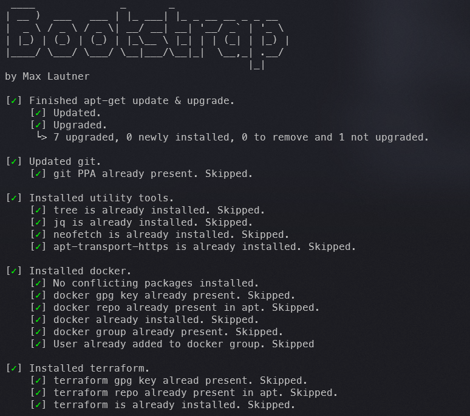

# Bootstrap

This is my old Bootstrap Script for a WSL 2 Ubuntu development environment and was used in conjunction with [yadm](https://yadm.io/#).
It has since been superseded by an alternative implementation with [ansible](https://www.ansible.com/), but is still very much functioning (it requires dotfiles though).

The main features of this script are idempotence, logging and cool looking terminal responses, which are achieved by moving the cursor:



## Includes: ##

- **Git**: Most recent version.
- **Utility**: tree, jq, neofetch, and apt-transport-https.
- **Docker.**
- **Terraform.**
- **Azure-CLI.**
- **VSCode Extensions.**
- **ZSH.**
- **Oh-My-Zsh.**
- **Oh-My-Zsh Plugins.**
- **Pyenv.**
- **Python Build Dependencies.**
- **Python.**

## Prerequisites

- Ubuntu 22.04 running on WSL 2.0
- Active internet connection

## Usage Instructions

1. **Installing and Bootstrapping**
   ```bash
   #update and install
   sudo apt-get update
   sudo apt-get install yadm
   #clone and run bootstrap
   yadm clone https://github.com/chinchyisbored/dotfiles.git
   yadm decrypt
   yadm remote set-url origin git@github.com:chinchyisbored/dotfiles.git
   yadm bootstrap
   ```
7. **VS Code Terminal Font**: Make sure to install [MesloLGS NF Regular.ttf](https://github.com/romkatv/powerlevel10k#manual-font-installation).

